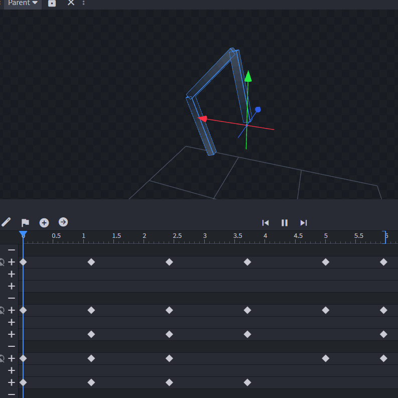

# Membrane

For wings, fins, webbing, or whatever else you can think of. I don't know, you are probably creative, right?

Stretches a plane into 4 defined spots on your model. Works with animations.

## Setup

Put empty groups at the positions the membrane should attach corners to. These groups should be 

Add a cube for the membrane, make it completely flat so only the front (north/south) side is used, set all other sides to use the "Transparent" texture (right click on the UV editing window, and select "Texture > Transparent"), which makes it so Figura doesn't load these faces. Only the front and back should have an actual texture.

This membrane cube should be centered at 0,0,0 in the middle of the grid in BlockBench.

Then, add the `membrane.lua` file into your avatar, and configure it **in your own script** like this:

```lua
local membrane = require("membrane")

membrane:define(models.modelName.membraneCube, {
    models.modelName.position1Group,
    models.modelName.position2Group,
    models.modelName.position3Group,
    models.modelName.position4Group
})
```

If you only want 3 positions, just use one of your positions twice, so that it still has access to 4 positions.

Example Test Animation:


